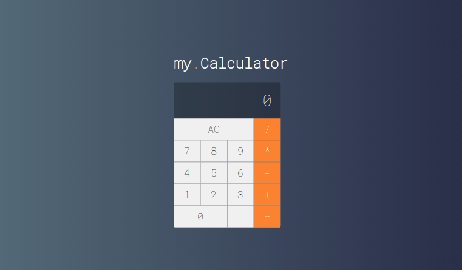

<h1 align="center">
  my.Calculator
</h1>

<h2 align="center">
  Sobre o projeto
</h2>

  

Uma calculadora construída com base no design da calculadora do macOS.

Acesse o projeto: https://hudsonsamuelsantos.github.io/my-calculator-react/

## 🚀 Tecnologias utilizadas

Esse projeto foi desenvolvido com as seguintes tecnologias:

- React
- JavaScript
- CSS
- HTML

## :memo: Licença

Esse projeto está sob a licença MIT. Veja o arquivo [LICENSE](LICENSE) para mais detalhes.

## Autor

Hudson Santos

https://www.linkedin.com/in/hudsonsamuelsantos/
